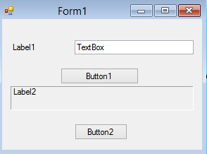

# Visual Basic Controls #

Everything you can see in your program is called a _**Control**_.

Figure 1. Simple program showing the _Text_ property of each control.

Controls are the main objects we manipulate in Visual Basic.  Each control has many _**Properties**_ and _**Methods**_ which provide a great deal of flexibility in how we make programs.

As programmers, we modify _**Controls**_ by changing their _**Properties**_

Figure 2. Same program showing the _Name_ property of each control.

In Visual Basic, the two properties _Text_ and _Name_ are among the most important to master first as they are used in virtually every program you create.

**Every** control in Visual Basic has a _Name_ property.
Users normally never see it, but it is important to the programmer.
The _Name_ property is used to refer to the control programmatically.

Most controls in Visual Basic have a _Text_ property.
The _Text_ property is used slightly differently in different controls, but it usually displays any text or an identifying label, if the control can display one.

Some Examples:

| **Control**  | **How _Text_ Property is used** |
|:-------------|:--------------------------------|
| Label      | Displays text to user |
| TextBox    | Displays text and also allows text editing |
| Form       | Displays text in title bar of window |
| Button     | Displays button caption |
| ComboBox  | Displays a prompt when no option from the box has been selected. |

Figure 3. Some common controls

## Setting the _Text_ Property in Code ##

It is possible to change the value of a text property after your program has been designed without any input from the user - you write some code!

Setting the text property is straightforward. Given a Label Control named 'lblStart', the expression could be:

`lblStart.Text = "Enter start time:"`

Things to notice:
  1. When setting a control property, it is **always** in the form
    * `<control name> <dot> <property name>`
    * As in  `lblStart.Text`
    * The dot (period) is an _**Operator**_ which always separates the object from its properties
  1. The expression result (the thing we want to assign a vaue to) is **always** on the left hand side of the equal sign.
  1. The right hand side of the expression always contains the thing we want to store or assign to the left hand side
  1. The two side of the expression are separated by an equal sign

Another thing to consider about the _Text_ property of controls...

Since it always stores _**text**_, the program only knows how to interpret it as such.  Computer treat strings and numbers very differently.

The string "2" looks to a person much like a number,
but a computer cannot make this distinction.
When you store a number in a text property or
the user enters a number in a TextBox, the value is **always** a string.

You have to convert the value in the text property to a number using one of
the TypeConversion functions or TryParse before you can use it as a number.

## More to Explore ##
  * [Windows Form Application Basics](https://msdn.microsoft.com/en-us/library/ms172749.aspx) from Microsoft Developer Network (MSDN)
  * [How to: Set the Text Displayed by a Windows Forms Control](https://msdn.microsoft.com/en-us/library/223fe5ka.aspx) from MSDN
  * [Introduction to Windows Forms video](https://www.youtube.com/watch?v=nif7ViGaNrs) from [thenewboston](https://www.thenewboston.com/videos.php)
  * [Toolbox video](https://www.youtube.com/watch?v=VpQnqqURLOQ) from [thenewboston](https://www.thenewboston.com/videos.php)

