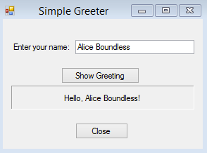
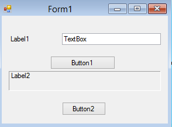

# What is Visual Basic? #

Visual Basic is a programming language.
It provides a means to create programs in the _**BASIC**_ language, _**Visually**_

  * [BASIC](http://en.wikipedia.org/wiki/BASIC) was originally a Procedural language
    * [Dartmouth BASIC](http://www.dartmouth.edu/basicfifty/basic.html), 1964
    * Visual Basic is very different
  * [Visual Basic](http://msdn.microsoft.com/library/xk24xdbe(v=vs.100).aspx) is
    * Visual – allows for ‘graphical programming’
    * Object-Oriented
    * Event-Driven

## Visual Basic is _Visual_ ##
The visual aspects of creating a program feel more like drawing.
Then you move controls from the palette to the designer and edit their properties, you are actually writing code.

Everything you can see in your program is called a _**Control**_

Figure 1. Simple program showing the _Text_ property of each control.

As programmers, we modify _**Controls**_ by changing their _**Properties**_

Figure 2. Same program showing the _Name_ property of each control.

## Visual Basic is _Object-Oriented_ ##

_Object-Orientation_ is an approach to writing programs.  It's based on the idea that programs can be broken down into reusable components, which at runtime are called _objects_.

Each object is defined by a _**Class**_
The _class_ describes:
  * the data associated with the object.
    * In Visual Basic, we refer to this data as the _**Class Properties**_
  * the _**Operations**_ or _**Methods**_ allowed on each property

Almost everything in Visual Basic is an Object
Controls
Data Types
etc.

## Visual Basic is _Event-Driven_ ##
An event is an action that takes place within a program.
  * Clicking a button (a Click event)
  * Typing in a TextBox (a TextChanged event)

Visual Basic controls are capable of publishing many, many events.

A program can respond to an event if the programmer writes an _**event procedure**_

## More to Explore ##
  * [Microsoft main launch page for Visual Basic](https://msdn.microsoft.com/en-us/library/2x7h1hfk.aspx)
  * [What is Visual Basic?](https://www.youtube.com/watch?v=mM3zB3QWuv8) from thenewboston
  * [Events video](https://www.youtube.com/watch?v=FZugcfyyOiM) from thenewboston
